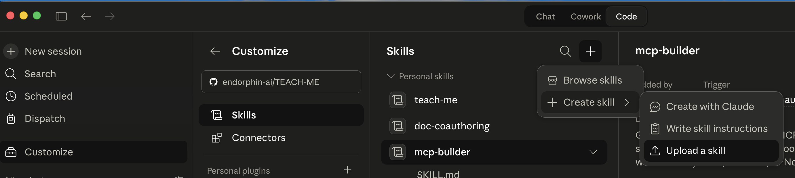

# TEACH-ME

Your personal CLAUDE Code teacher

# /teach-me — AI Teacher Agent

An AI skill that turns Claude into a real teacher — one that studies before teaching, remembers what you've learned, adapts to your level, and gets better every session.

Unlike asking ChatGPT to "explain quantum physics," `/teach-me` follows a structured teaching methodology: it researches the topic from authoritative sources (MIT OpenCourseWare, official docs), builds a concept map, prepares analogies and examples, then teaches you interactively through conversation — checking your understanding at every step.

## Why This Exists

Most AI "teaching" is just information dumping. A real teacher:

- **Studies the material** before walking into class — doesn't wing it
- **Knows YOU** — your level, your struggles, what worked last time
- **Checks understanding** — doesn't move on until you actually get it
- **Remembers everything** — picks up exactly where you left off next session
- **Gets better over time** — refines explanations based on what works

This skill does all of that.

https://youtu.be/qPhMqIzmbLU?si=RPYUhJ4iurskleaq

## Install

Drop the `teach-me.skill` file into your Claude skill directory, or clone the repo:

```bash
git clone https://github.com/yourname/teach-me.git
# Then point your Claude Code or Claude.ai skill path to the teach-me/ folder
```



## Quick Start

```
You:    /teach-me quantum physics
Claude: [researches topic silently]
        "Quantum physics is a big topic — I've mapped out 4 modules.
         Before we start, what's your math background?"

You:    I know basic calculus
Claude: "Perfect. Let's start with why classical physics breaks..."
        [teaches interactively, one concept at a time]

You:    quiz me
Claude: "Q1: If I double the brightness of a UV light hitting metal,
         what happens to each ejected electron's energy?"

You:    It doubles?
Claude: "I see the reasoning — brighter should mean more energy.
         But here's the catch: brightness increases the NUMBER of
         photons, not the energy of each one..."

You:    that's enough for today
Claude: "Great session! You covered the photoelectric effect and
         wave-particle duality. Homework: watch MIT 8.04 Lecture 3.
         Module 1: 1 of 3 sessions complete. Say 'continue' next time."
```

Next day:

```
You:    continue
Claude: "Welcome back! Last time we covered wave-particle duality.
         Did you get a chance to watch the MIT lecture?"
```

## Commands

### Starting a Session

| Command                                      | What Happens                            |
| -------------------------------------------- | --------------------------------------- |
| `/teach-me [topic]`                          | Interactive teaching session            |
| `/teach-me [topic] from [URL]`               | Teach from specific documentation       |
| `/teach-me [topic] from this repo`           | Teach from a code repository            |
| `/teach-me [topic] --course`                 | Generate a downloadable tutorial course |
| `/teach-me [topic] --course --format=html`   | Course as interactive HTML              |
| `/teach-me [topic] --course --format=md`     | Course as markdown files                |
| `/teach-me [topic] --course --format=jekyll` | Course as GitHub Pages site             |

### During a Session

| Command                     | What Happens                                   |
| --------------------------- | ---------------------------------------------- |
| `quiz me` / `test me`       | Switch to quiz mode (teacher asks, you answer) |
| `explain that again`        | Re-explain with a different approach           |
| `I don't get it`            | Simpler explanation with more analogies        |
| `go deeper`                 | More detail on the current concept             |
| `skip this` / `I know this` | Move to the next concept                       |
| `show me an example`        | Get a concrete, runnable example               |
| `what's the roadmap?`       | See your full learning path with progress      |

### Ending a Session

| Command                   | What Happens                                   |
| ------------------------- | ---------------------------------------------- |
| `that's enough for today` | End session → recap → homework → save progress |
| `let's stop here`         | Same as above                                  |
| `thanks` / `bye`          | Same as above                                  |

Progress is **always saved automatically** when a session ends.

### Resuming

| Command                  | What Happens                                    |
| ------------------------ | ----------------------------------------------- |
| `continue`               | Resume from exactly where you left off          |
| `where were we?`         | Same — loads your progress and continues        |
| `/teach-me [same topic]` | Detects you're returning, resumes automatically |
| `quiz me on [topic]`     | Quiz on previously learned material             |
| `what have I learned?`   | Show progress across all topics                 |

## How It Works

### The 6-Stage Pipeline

Every teaching session follows this pipeline. Stages 0–5 happen **silently** before the teacher says a word to you:

```
┌─────────────────────────────────────────────────┐
│              PERSISTENT LAYER                   │
│  knowledge/{topic}/  — teacher's library        │
│  students/{id}/      — your profile + progress  │
├─────────────────────────────────────────────────┤
│              BEFORE TEACHING (silent)            │
│                                                 │
│  Stage 0: LOAD     — check what I already know  │
│  Stage 1: STUDY    — research from real sources  │
│  Stage 2: UNDERSTAND — build deep comprehension  │
│  Stage 3: MAP      — structure for teaching      │
│  Stage 4: PLAN     — design this specific lesson │
│  Stage 5: PREPARE  — craft analogies + examples  │
├─────────────────────────────────────────────────┤
│              TEACHING (you see this part)        │
│                                                 │
│  Stage 6: TEACH                                 │
│    Phase 1: Orient (level check, goal, track)   │
│    Phase 2: Build (concept by concept)          │
│    Phase 3: Apply (challenges + homework)       │
│    Phase 4: Solidify (recap + next steps)       │
├─────────────────────────────────────────────────┤
│              AFTER TEACHING (silent)             │
│                                                 │
│  Stage 7: SAVE — update knowledge + your profile│
│    → what worked, what didn't, where you stopped│
│    → teacher gets better every session           │
└─────────────────────────────────────────────────┘
```

### Knowledge Sources

The teacher doesn't rely on training data alone. It actively researches from:

1. **Official documentation** (always fetched first, always trusted most)
2. **MIT OpenCourseWare** — 2,500+ courses for CS, math, science, engineering
3. **Web search** — current tutorials, common mistakes, comparisons
4. **Your provided source** — docs URL or code repository you point it to

The teacher saves everything it learns to `knowledge/{topic}/` so it never re-researches the same topic. Physics knowledge refreshes yearly. Framework knowledge refreshes quarterly.

### How It Remembers You

Your learning profile is saved across sessions:

```
students/{you}/
├── profile.json     — your math level, learning style, goals
├── progress.json    — concepts mastered, partial, introduced
├── struggles.json   — patterns in what you get wrong
└── sessions/        — log of every session with next-session plan
```

When you come back, the teacher knows:

- Where you left off (exact module, session, concept)
- What you struggled with (and has a new approach ready)
- What homework you were assigned
- What analogies worked for you vs. didn't

## Workflows

### Workflow 1: Learning a New Topic

```
You: /teach-me machine learning

[Teacher silently: searches official docs, MIT 6.036, common mistakes.
 Reads deeply. Builds concept map. Prepares analogies. Detects this
 is a LARGE topic → generates a 5-module roadmap.]

Teacher: "Machine learning is a big field — I've mapped out 5 modules
         for you, from linear regression to neural networks. Today
         we'll start with Module 1: What Is ML?

         Quick question — are you comfortable with linear algebra
         (vectors, matrices) or should we take the conceptual route?"

You: I know some linear algebra

Teacher: "Perfect. Here's the core idea — instead of writing rules,
         you show a computer examples and it figures out the rules
         itself. Think of it like this: [analogy]..."

         [teaches concept 1 → checkpoint → concept 2 → checkpoint...]

Teacher: "Quick check — in your own words, what's the difference
         between a model that memorizes the training data and one
         that actually learns the pattern?"

You: One would fail on new data?

Teacher: "Exactly — that's overfitting vs. generalization, and it's
         the single most important idea in all of ML..."
```

### Workflow 2: Resuming a Previous Topic

```
You: continue

Teacher: "Welcome back! Last time we finished linear regression and
         you had homework to plot a loss function. How did that go?"

You: I did it but I'm confused about why the gradient points downhill

Teacher: "Great question — that's actually the key to understanding
         gradient descent. Let me try a different angle..."
```

### Workflow 3: Learning from Documentation

```
You: /teach-me playwright from https://playwright.dev/docs/intro

[Teacher: fetches official docs FIRST. Crawls the full site.
 Identifies gaps: docs are reference, not tutorial. No progressive
 project. Locators scattered across 4 pages.]

Teacher: "I've read through the Playwright docs. They're comprehensive
         but they're organized as reference, not for learning. I'll
         reorganize this as a journey — by the end you'll have a
         complete test suite.

         Have you used any browser testing tools before?"
```

### Workflow 4: Quiz Mode

```
You: quiz me

Teacher: "I'll quiz you on what we've covered. Here we go.

         Q1: A photon with wavelength 400nm hits a metal surface.
         What determines whether an electron gets ejected?"

You: The brightness of the light?

Teacher: "I see the reasoning — brighter light feels like it should
         have more energy. But brightness is about the NUMBER of
         photons, not each photon's energy. What actually determines
         whether an electron escapes is the photon's frequency —
         each photon needs enough energy individually to overcome
         the work function.

         Q2: So if I use red light, no matter how bright, what happens?"

You: No electrons come out because red photons don't have enough energy?

Teacher: "Exactly right! The frequency is too low. You could point a
         stadium-full of red lasers at the metal and nothing happens.
         One single UV photon would do the job. That's quantization."
```

### Workflow 5: Generating a Course

```
You: /teach-me React hooks --course --format=html

[Teacher: researches React hooks from official docs (react.dev),
 builds concept map, generates full course with 8 tutorials]

Teacher: "Here's your React Hooks course — 8 tutorials, ~4 hours total."

[Delivers a single interactive HTML file with:
 - Sidebar navigation
 - Progress tracking (localStorage)
 - Dark mode
 - Syntax-highlighted code with copy buttons
 - Common mistakes sections
 - Challenges with collapsible hints
 - Quiz checkpoints every 2-3 tutorials]
```

### Workflow 6: Ending and Saving

```
You: that's enough for today

Teacher: "Great session! Here's what we covered:

         • Overfitting vs. generalization — remember the 'memorizing
           the textbook vs. understanding the subject' analogy
         • Train/test split — always hold out data you've never
           trained on
         • Cross-validation — the 'rotating exam' approach

         Your progress: Module 2 — 2 of 3 sessions complete
         ████████████░░░░░░░ 67%

         Homework:
         📺 Watch 3Blue1Brown's gradient descent video (18 min)
         📝 Try splitting the iris dataset 80/20 and measure accuracy

         Next session: regularization and the bias-variance tradeoff.
         Say 'continue' anytime to pick up here."

[Silently saves: progress, struggles, session log, improved teaching notes]
```

## Teaching Methodology

The skill uses research-backed teaching techniques:

| Technique                            | What It Means                                                                   |
| ------------------------------------ | ------------------------------------------------------------------------------- |
| **Analogy First**                    | Every new concept starts with a comparison to something you already know        |
| **Show, Then Explain**               | You see the code/equation/experiment first, explanation comes after             |
| **WHY Before HOW**                   | Motivation before mechanics — you always know why something exists              |
| **Socratic Checkpoints**             | The teacher asks you questions to verify understanding before moving on         |
| **Error Sandwich**                   | Wrong answers get: validate your thinking → correct → connect to bigger picture |
| **Progressive Complexity**           | Simplest version first, complexity added one layer at a time                    |
| **Spaced Review**                    | Earlier concepts revisited in new contexts every few sessions                   |
| **Conceptual + Mathematical Tracks** | For STEM topics, you choose: intuition-only or full formalism                   |

## Topics It Handles Well

| Category                   | Examples                                                        | Source                    |
| -------------------------- | --------------------------------------------------------------- | ------------------------- |
| **Computer Science**       | Algorithms, data structures, OS, networks, distributed systems  | MIT OCW + official docs   |
| **Mathematics**            | Linear algebra, calculus, probability, discrete math            | MIT OCW                   |
| **Physics**                | Quantum mechanics, electromagnetism, relativity, thermodynamics | MIT OCW                   |
| **Frameworks**             | React, Playwright, Next.js, Django, Express                     | Official documentation    |
| **Languages**              | Python, TypeScript, Go, Rust                                    | Official docs + tutorials |
| **ML/AI**                  | Neural networks, transformers, RL, computer vision              | MIT OCW + papers          |
| **Any documentation site** | Give it a URL and it teaches from those docs                    | Your provided URL         |
| **Any code repository**    | Point it at a repo and it explains the codebase                 | Your codebase             |

## Architecture

```
teach-me/
├── SKILL.md                              ← Orchestrator (389 lines)
└── references/
    ├── learning-pipeline.md              ← Concrete search queries + execution
    ├── knowledge-store.md                ← How teacher saves/loads topic knowledge
    ├── student-model.md                  ← Learner profiles, progress, homework
    ├── roadmap-builder.md                ← Multi-module paths for large topics
    ├── workflows.md                      ← Every possible path through the system
    ├── quiz-mode.md                      ← Question types + feedback system
    ├── stage-1-study.md                  ← Research methodology
    ├── stage-2-understand.md             ← Comprehension + difficulty taxonomy
    ├── stage-3-map.md                    ← Concept sequencing
    ├── stage-4-plan.md                   ← Lesson design + session architecture
    ├── stage-5-prepare.md                ← Analogy construction + example design
    ├── stage-6-teach.md                  ← Delivery + Socratic method
    ├── mit-ocw.md                        ← MIT course directory + search patterns
    ├── course-builder.md                 ← Full course generation pipeline
    ├── format-html-interactive.md        ← Interactive HTML spec (KaTeX + viz)
    ├── format-markdown.md                ← Markdown output spec
    ├── format-github-pages.md            ← Jekyll site spec
    ├── analysis-schema.md                ← JSON schemas for analysis
    └── teaching-examples.md              ← Example sessions for calibration
```

20 files · 5,567 lines · 81 KB

## Data Storage

The skill creates two persistent directories:

```
knowledge/                           ← Teacher's library (grows over time)
├── quantum-physics/
│   ├── meta.json                    ← Freshness, sources, confidence
│   ├── sources.md                   ← URLs, quality ratings
│   ├── concept-map.md               ← Concepts + prerequisites + ordering
│   ├── teaching-notes.md            ← Analogies, examples, mistake cards
│   ├── misconceptions.md            ← Common student errors + corrections
│   └── roadmap.md                   ← Multi-module learning path
├── playwright/
└── react-hooks/

students/                            ← Per-learner profiles
└── {id}/
    ├── profile.json                 ← Level, style, goals
    ├── progress.json                ← Mastery per concept per topic
    ├── struggles.json               ← Error patterns
    └── sessions/                    ← Session history
```

Knowledge persists across students. Student data persists across sessions. The teacher improves every time it teaches.

## License

MIT
